# Modelando upwelling en el Cañón Carson

## Introducción
En el contexto de la asignatura de Modelización de la Universidad de Vigo, del curso 2017-2018, dentro de los objetivos de la asignatura está el aprendizaje de la plataforma de modelización ROMS Agrif [[1]](https://www.croco-ocean.org/). Para ello, como objetivo evaluable para cada alumno, se plantea la presentación de una experiencia libre desarrollada con dicho software. 

La zona de estudio elegida fue la zona de Newfoundland y la Corriente del Labrador por ser una zona de interés desde un punto de vista oceanográfico. Esta corriente es una corriente fria formada como combinación de la corriente West Greendland y la corriente de la Isla de Baffin. Es una corriente de agua fria que fluye desde el Estrecho de Hudson (60ºN) pegada a la plataforma continental hasta la cola de Grand Banks(43ºN) (Smith et al., 1937).

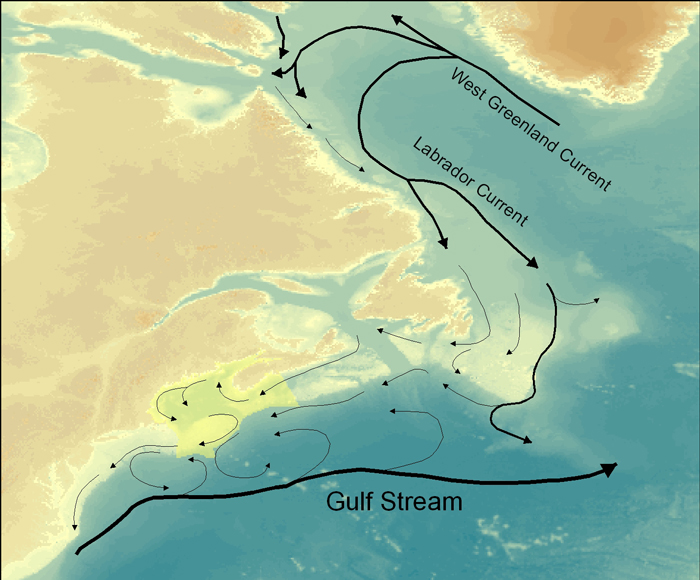

*Fig 1. Esquema de la Corriente del Labrador*

A partir de la selección de la zona de estudio, se revisaron trabajos relacionados con la idea de intentar reproducir los resultados de alguno de esos trabajos desde el software y comparar los resultados obtenidos en el trabajo con los resultados obtenidos desde el modelo. 

Para realizar esta comparación se eligió el estudio **Kinsella, E. D., A. E. Hay, and W. W. Denner (1987), Wind and topographic effects on the Labrador Current at Carson Canyon, J. Geophys. Res., 92(C10), 10853–10869, doi: 10.1029/JC092iC10p10853**. [[2]](http://www.phys.ocean.dal.ca/people/po/Haypubs/KinsellaHayDenner_JGR1987.pdf).

Esta Tesis de Master fue realizada en 1987 con la intención de comprobar la interacción entre una corriente que fluye pegada a la plataforma y un cañón submarino. La corriente será la corriente del Labrador y el cañón submarino será el Cañón Carson.

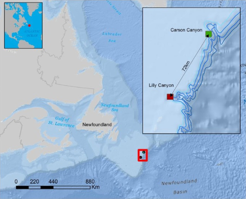

*Fig 2. Situación del Cañón Carson*

El Cañon Carson es un cañon submarino situado en la Región de Grand Banks que cruza el talud por la parte sureste del límite de la región. Sus características oceanográficas están dominadas por la Corriente del Labrador. Esta fluye en esa zona del noreste al suroeste, aproximadamente paralela a la isobata de 200m. Está confinada sobre los 200-300m de la columna de agua y tiene un ancho de 50 km con una velocidad media en su núcleo de 50 cm s<sup>-1</sup> (Kinsella. et. al, 1987)

Para realizar una comparación de los datos del estudio con los del modelo, se preparará una configuración que emule las condiciones en las que se realizó el estudio por Kinsella et al. y se intentarán realizar las medidas similares mediante el software Matlab[[3]](https://www.mathworks.com/products/matlab.html) presentando los datos de manera comparada.

## Configurando el modelo

### Zona de estudio
Para realizar la modelización de nuestra zona de interés, definiremos primero una malla madre cuyo bounding box tendrá las coordenadas en sistema EPSG:4326 (-40, 50) y (-56, 40).

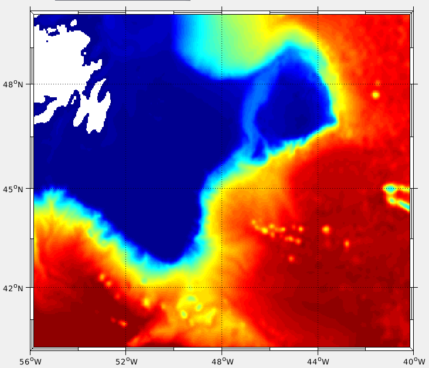
*Fig 3. Contorno de la malla madre*

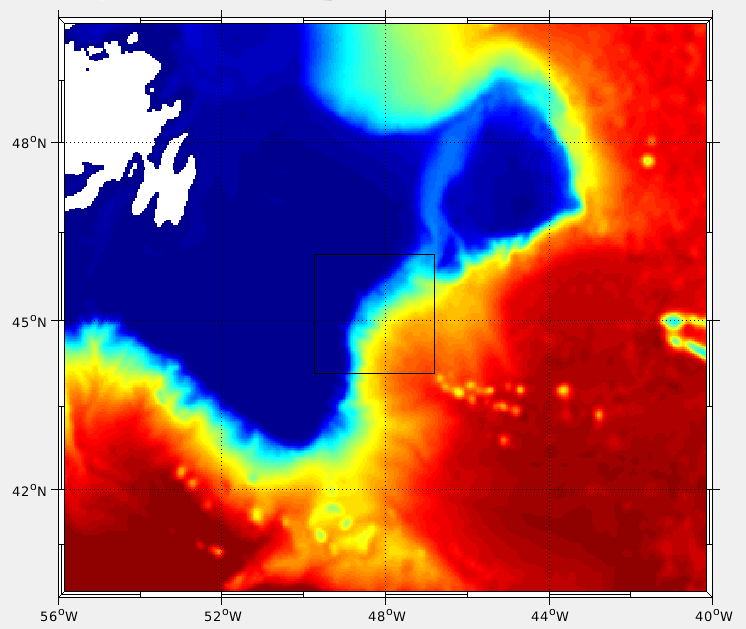
*Fig 4. Contorno de la malla hija*

### Batimetría
El Cañón Carson tiene un ancho de 4 km de ancho por 56 km de largo. Debido a que el estudio trata sobre el efecto de la Corriente del Labrador sobre la topografía del cañón, deberemos generar la topografía con la mejor resolución posible. En primer lugar utilizaremos la batimetría de GEBCO para la malla madre. GEBCO es la batimetría publica de los oceanos publicada por la International Hydrographic Organization (IHO) y la Intergovernmental Oceanographic Commission (IOC) (de la UNESCO).

El dataset utilizado para la batimetría de la zona de estudio se descargó directamente desde GEBCO[[4]](https://www.gebco.net/data_and_products/gridded_bathymetry_data/gebco_30_second_grid/). Se trata de la batrimetría `GEBCO_2014_Grid`, batimetría global con una resolución de arcos de 30 segundos.

La batimetría se debió adaptar para ser usada en ROMS. Los datos de batimetría usados en ROMS por defecto son los `etopo2` que provee la NOAA. ROMS está preparado para leer datos de topografía que contengan las variables `lon`, `lat` y `topo` de tipo `float` las tres. En el caso de `gebco` el valor de la batimetría está guardado en la variable `elevation` por lo que habrá que renombrar esta variable a `topo`. Realizamos esta operación mediante el uso del comando `ncrename`. Después configuramos `romstools_param.m` para que ROMS utilizase la batimetría de GEBCO:

```
%
%  Topography netcdf file name (ETOPO 2 or any other netcdf file
%  in the same format)
%
TOPODIR = '../';
%topofile = [TOPODIR,'Topo/etopo2.nc'];

topofile = [TOPODIR,'GEBCO/gebco_topo.nc'];
```

Para la malla hija se utilizó una batimetría de mayor resolución. Se obtuvo de la NOAA[[5]](https://data.nodc.noaa.gov/cgi-bin/iso?id=gov.noaa.ngdc.mgg.dem:11503) un dataset con resolución de 3 segundos. Tal como en el caso anterior, se tuvo que modificar el archivo `netCDF` para adaptarlo al ROMS. Con este dataset se generó la batimetría de la malla hija.

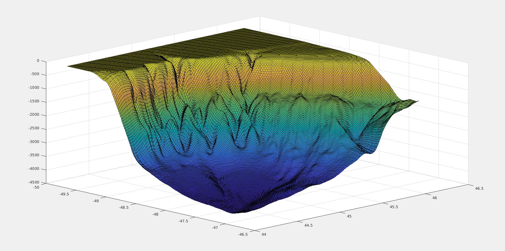
*Fig 5. Batimetría de la malla hija generada con Matlab*

## Comparando resultados
El estudio de Kinsella, 1987, utilizó datos tomados de dos campañas diferentes una en 1980 y la otra en 1981. Los sensores utilizados fueron CTDs y correntímetros. A partir de los datos de los CTDs se generaron perifles de salinidad y temperatura. Los datos de temperatura estaban relacionados con la marea, así que en primer lugar lo que se hizo fue configurar el modelo para añadirle la marea. 

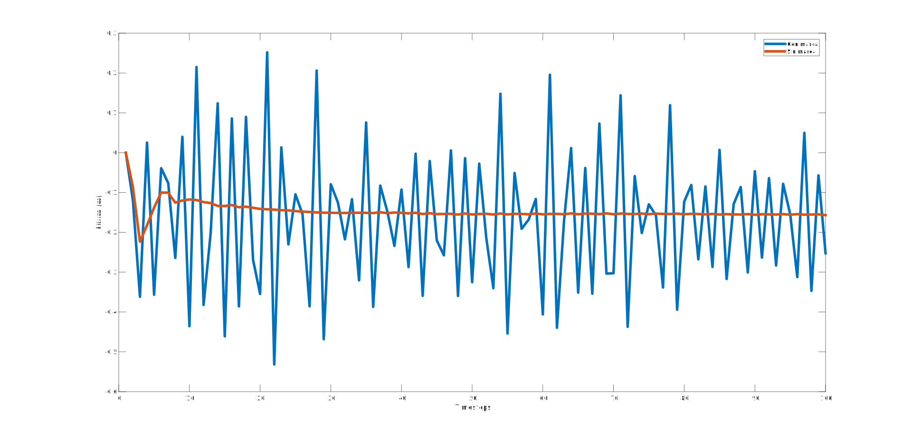
*Fig 6. Comparación altura superficie libre (**zeta**) con marea y sin marea*

Los datos de marea en el estudio de Kinsella se obtuvieron a partir de los mareografos situados en la plataforma de petroleo Hibernia[[6]](https://en.wikipedia.org/wiki/Hibernia_oil_field) coordenadas (46°45.026′N 48°46.976′W), y están simulados para las mismas coordenadas en el modelo.

Con los datos de los CTDs realizaron secciones de temperatura y salinidad. 

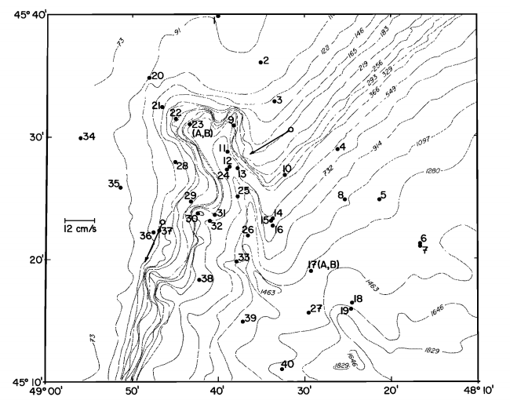

*Fig 7. Zona de estudio Kinsella, 1987. Los puntos indican toma de datos con CTDs*

Se emularon perfiles de salinidad y temperatura para la misma zona a partir de los datos del modelo. Los perfiles se realizaron mediante secciones latitudinales.

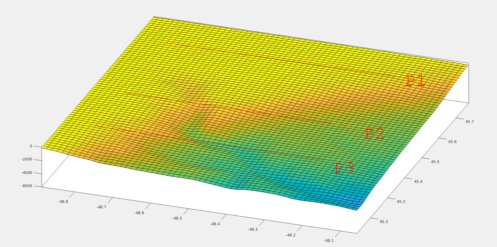
*Fig 8. Perfiles latitudinales generados*

El resultado de estos perfiles para un tiempo **t=38** (10 días desde que se arrancó el modelo):

| Temperatura | Salinidad |
|---|---|
| 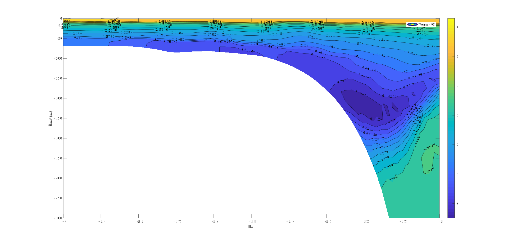  | 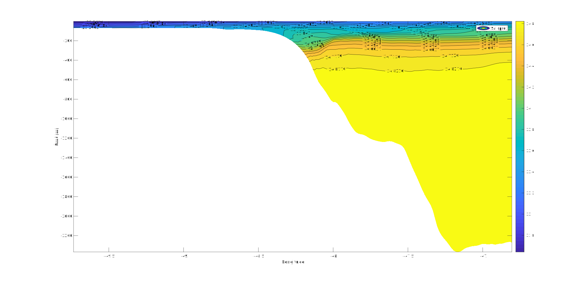 |
| 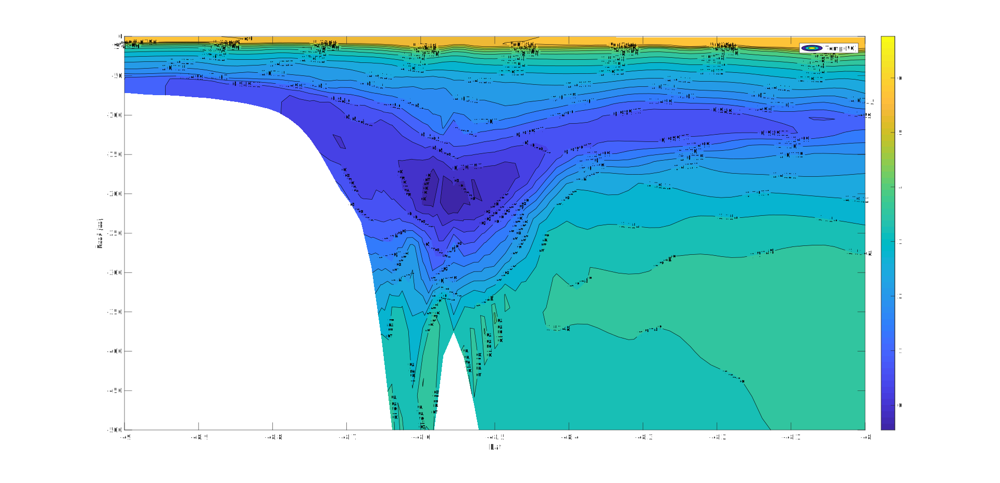  | 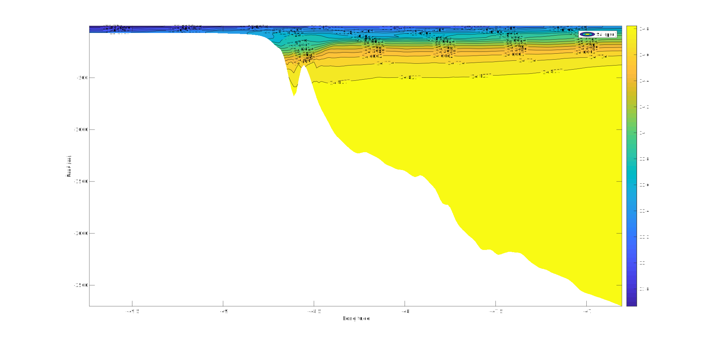 |
| 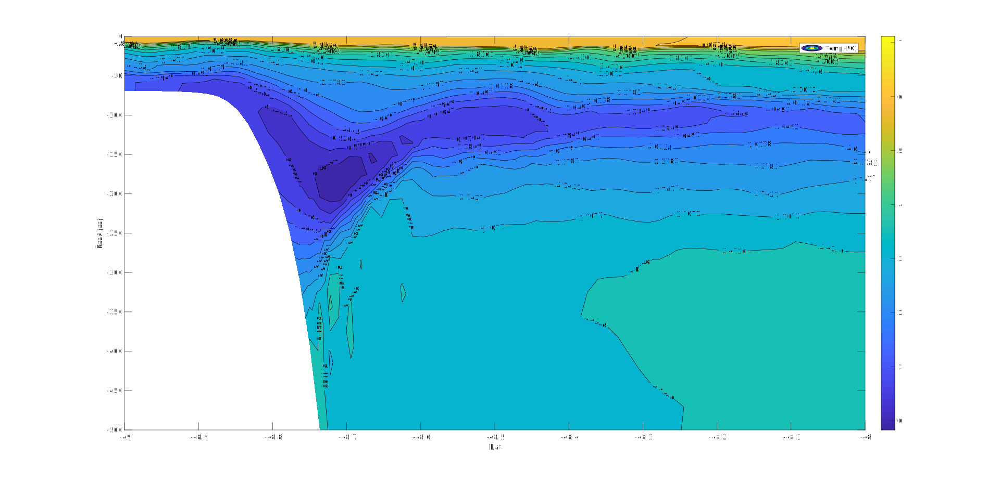  | 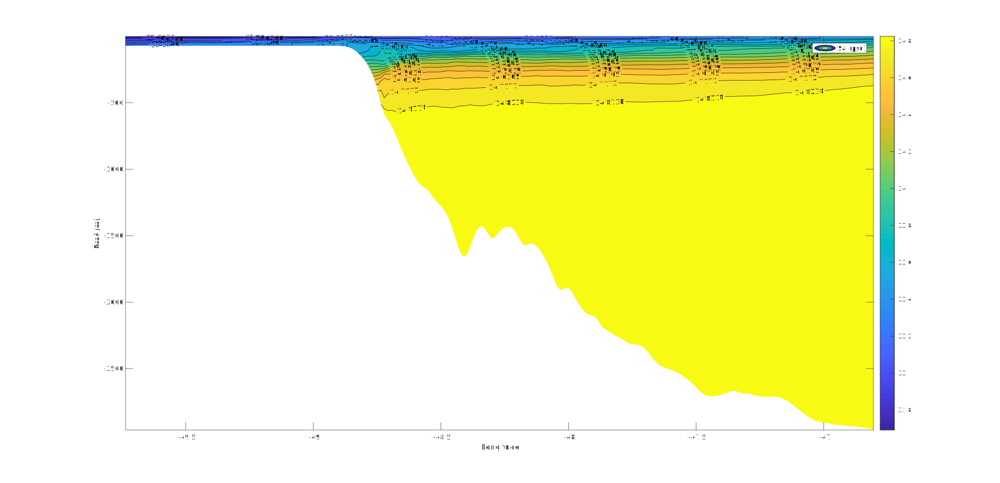 |

En el estudio de Kinsella, 1987, se obtenían datos de temperatura y salinidad de correntímetros. Los correntímetros estaban instalados a 120 y 164 metros de profundidad uno en las coordenadas (45.516667, -48.516667) y el otro en las coordenadas (45.366667, -48.783333). Para el situado a 164m se obtuvieron perfiles de temperatura, salinidad y velocidades horizontales y verticales.

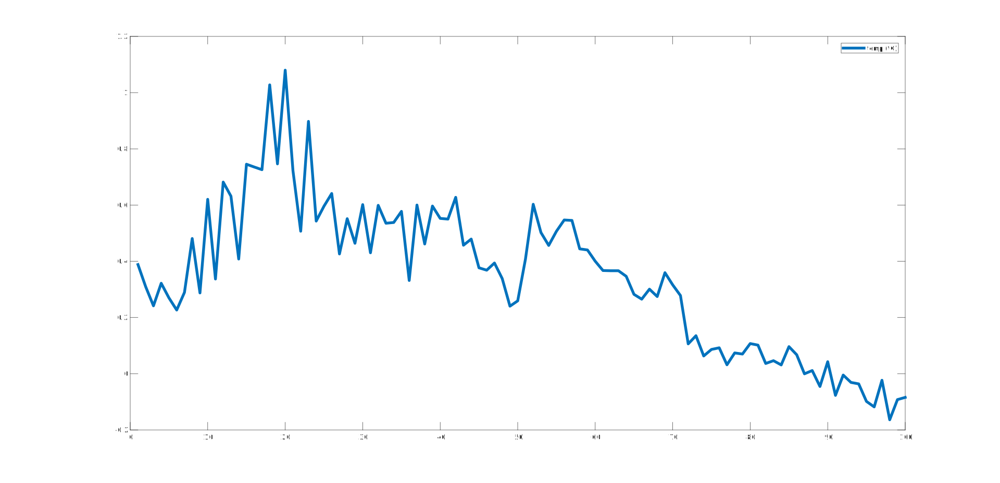
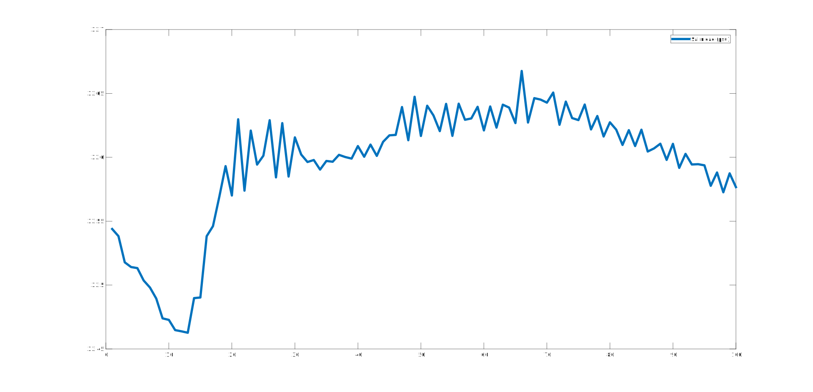
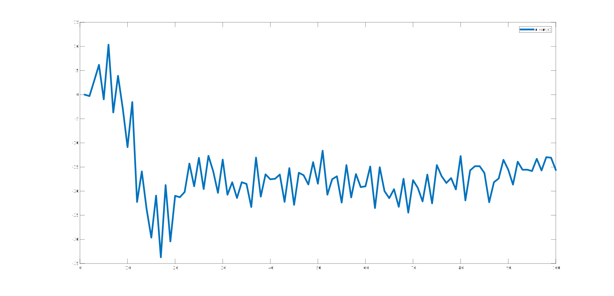
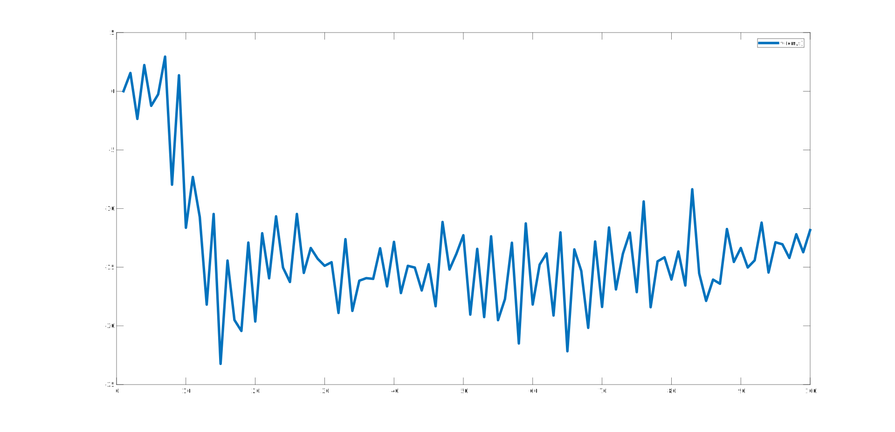
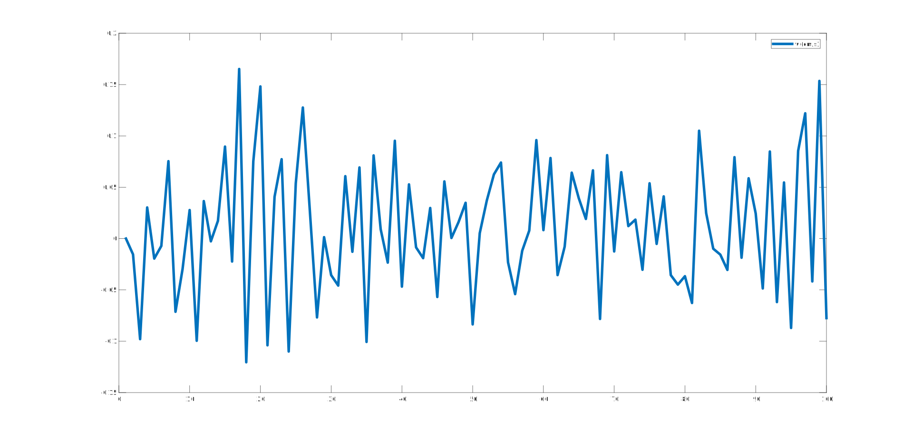
*Fig 9. Perfiles de Temperatura, componentes u y v de la velocidad y velocidad vertical.*

y a partir de los datos de u y v se calcularon la intensidad de la corriente y la dirección de la misma.

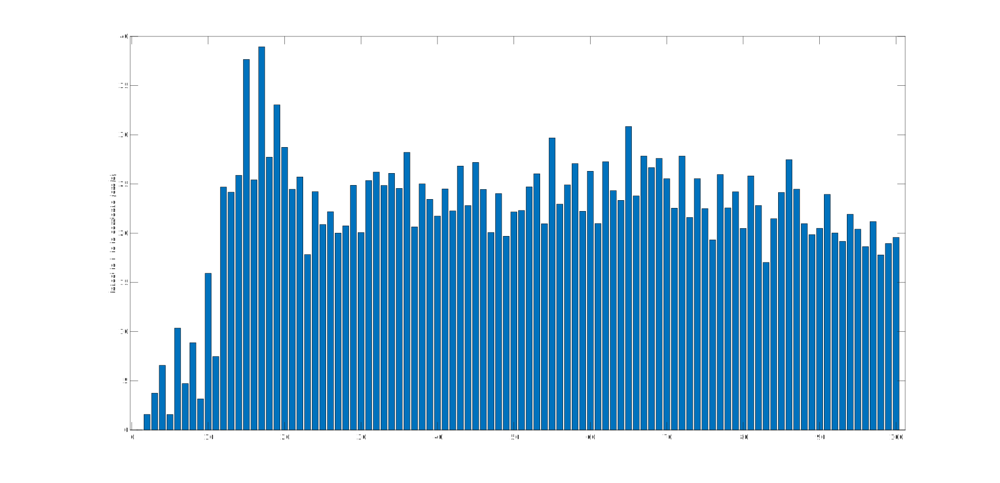
*Fig 10. Itensidad de la corriente (cm/s)*

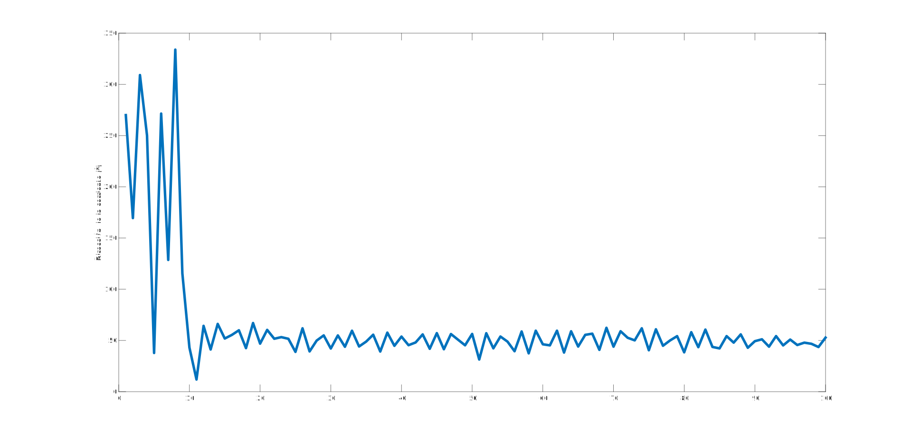
*Fig 11. Perfíl de dirección de la corriente (º)*

Para comprobar si existe relación entre la velocidad vertical y la marea se realizó la corrección de esta componente eliminando el efecto de la marea.

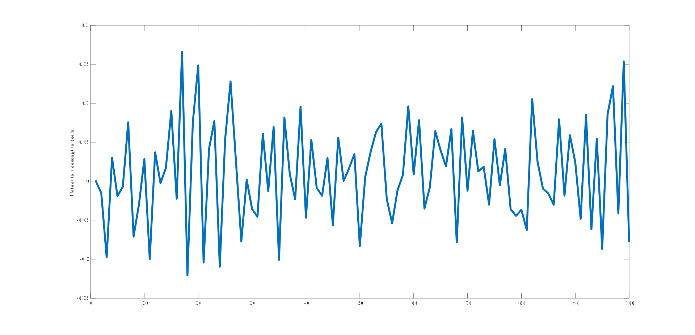
*Fig 12. Perfíl de velocidad vertical corregido con la marea*

Otro de los datos en los que se apoya el estudio de Kinsella, 1987, es en los vientos que afectaron la zona durante la época de muestreo. Estos fueron medidos en la plataforma Hibernia. A partir de los datos del modelo obtuvimos:

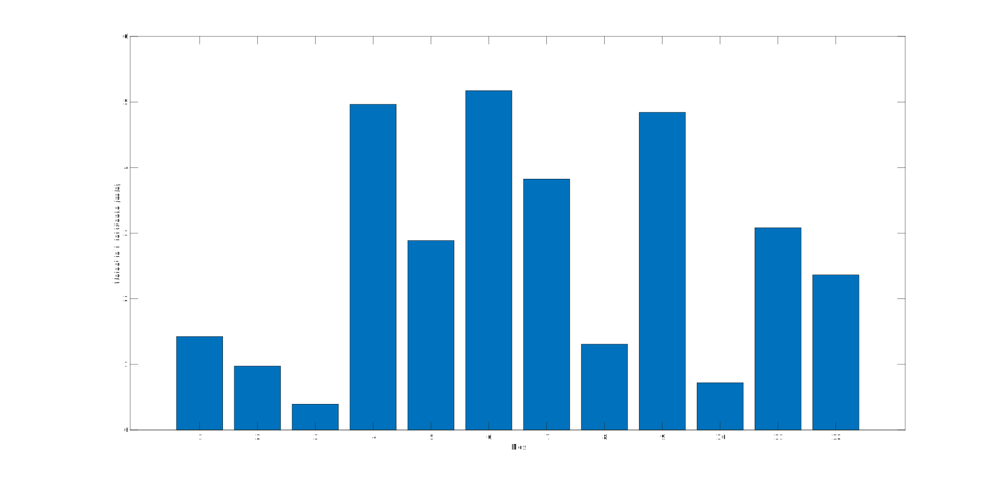
*Fig 13. Velocidad del viento en las coordenadas de Hibernia*

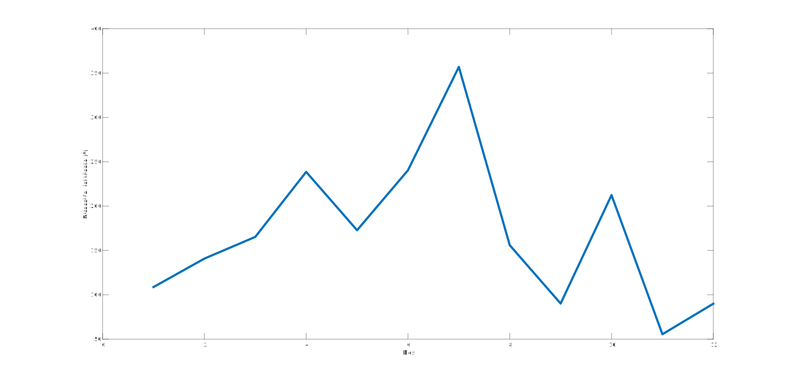
*Fig 14. Dirección del viento en las coordenadas de Hibernia*

## Conclusiones
A partir de los datos del modelo no hemos sido capaces de detectar ningún proceso de afloramiento. La componente vertical de la velocidad en el correntímetro parece estar afectada por la marea, pero al realizar la correción eliminándole esta, no se aprecia variación en la misma. El calculo de la correción se ha realizado dividiendo la marea por los segundos del día (86400) para obtener la velocidad media diaria de la marea y restñandole esta a la componente vertical de la velocidad.

Por otro lado en el estudio de Kinsella, se observaba el upwelling en consonancia con el regimen de vientos de la zona. La aparición de una tormenta propiciaba el proceso de upwelling. Otro de los posibles problemas es que no se ha modelado este viento ya que dentro de las condiciones de contorno solo tenemos un valor de viento por mes.

Las carácterísticas de la Corriente del Labrador que se describen en Kinsell, 1987, encajan con las que se han obtenido dentro del modelo. Tanto la dirección de la corriente, la intensidad y su situación con respecto a la batimetría encajan con lo descrito en el estudio.

## Anexo
### Configuración del modelo
La configuración del modelo se puede descargar de [aquí]()

